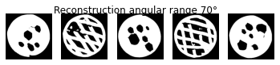
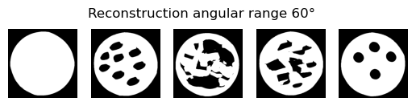

# Submission to the Helsinki Tomography Challenge 2022

Table of contents
1. [Installation and Usage](#installationandusage)
2. [Method](#method)
3. [Examples](#examples)
    1. [Synthetic Data](#syntheticdata)
    2. [Challenge Data](#challengedata)
5. [Authors](#authors)

## Installation and Usage

We provided the `enviroment.yml` file to restore the conda enviroment used for the submission. You can create the enviroment using the following command:

```
conda env create -f environment.yml
```

The networks weights are fairly small (~10MB) per difficulty level so we store them directly in the repository. We created a script `main.py` to reconstruct phantoms from limited-angle measurements: 

```
python main.py /path_to_input_folder /path_to_ouput_folder difficulty_level
```

We have uploaded a few limited-angle measurements for the 30° case as an example: 

```
python main.py examples/limited_angle_30/ output_images/ 7
```

Currently we can handle both files in MATLAB 5.0 and MATLAB 7.3 format.


## Method

The method is based on the idea presented in the paper [Bubba et. al. (2019)](https://iopscience.iop.org/article/10.1088/1361-6420/ab10ca). In limited angle tomography, edges which are parallel to X-ray beams can be reliably reconstructed (visible edges) while others cannot (invisible edges). Therefore, we start calculating a first reconstruction using a variational method. Then, we extract the visible edges and use learning
based methods to inpaint the invisible edges. In total we have the following steps:

- Normalization of the input sinogram.
- Initial reconstruction with iterative variational method.
    - loss function: $\frac{1}{2} \|Ax - y \|^2 + \text{perona_malik}(x) + b(x)$, where $b$ is a W-shaped function which prefers images $x$ with binary values and $A$ is the ray transformation.
- Extraction of visible edges (according to angular range).
    - The wavefrontset is approximated by computing the gradient field of the initial reconstruction. All gradients which correspond to invisible edges are left out.
- Inpainting of missing edges with a U-Net [Ronneberger et. al. (2015)](https://link.springer.com/chapter/10.1007/978-3-319-24574-4_28).
- Segmentation with a U-Net to get the (binary) final reconstruction using the inpainted output of the previous U-Net.

The input normalization shall make the variational reconstructor invariant to changes in the intensity of the phantoms. For the (supervised) training of the networks we used synthetic phantoms generated with different methods (see section Synthetic Training Data).

### Forward Operator

The exact forward operator was not specified in the challenge. Therefore we used the information provided by the challenge organizer and the metadata of the matlab files to build an approximate forward operator using [ODL](https://odlgroup.github.io/odl/).

### Specifications of the architecture

The architecture and the training setup of the two U-Nets [Ronneberger et. al. (2015)](https://link.springer.com/chapter/10.1007/978-3-319-24574-4_28) (segmentation and inpainting) can be described as follows:

- 6 scales
- number of channels for each scale: 16,32,64,128,256,256
- number of skip channels: 16,32,64,128,256
- kernel size: 7
- activation function: LeakyReLU (negative slope of 0.2), Sigmoid at the output layer
- group normalization (due to small batch size)
- loss: weighted binary cross entropy with a weight on edges and areas with value '1', respectively
- batch size: 4
- learning rate: 2e-5 (inpainting) 1e-5 (segmentation)
- optimizer: [Adam](https://doi.org/10.48550/arXiv.1412.6980)

### Synthetic Training Data

We implemted four different methods to generate new phantoms:
- Disk with non-overlapping circular holes
- Disk with non-overlappling polygonal holes
- Disk with holes using two sets of lines with different angles
- Disk with holes using the level-set of sums of gaussians

The phantoms were created on the fly during training. The center point of the disk was choosen randomly near the center of the image.

The challenge data was only used for validation of the model.


### Dealing with Different Angular Subsets

The forward operator gets adapted to the provided angular range of the measurements.

## Examples

We plot a few example reconstructions for the provided challenge phantoms and our synthetic phantoms.

<div id="syntheticdata"/>

### Synthetic Data 





<div id="challengedata"/>

### Challenge Data 





